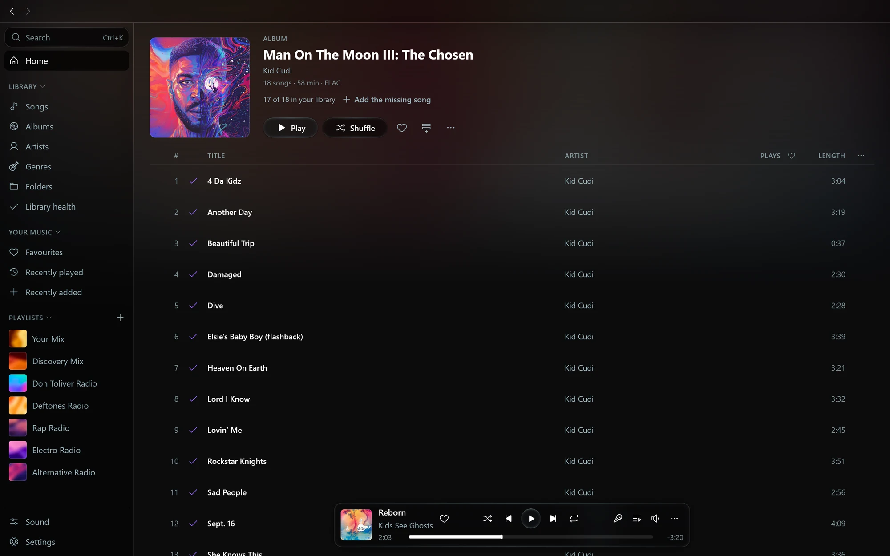
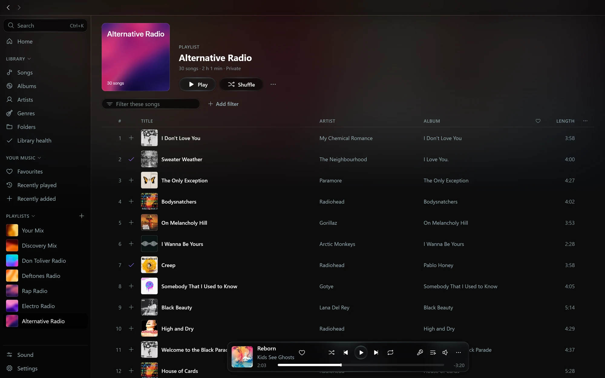
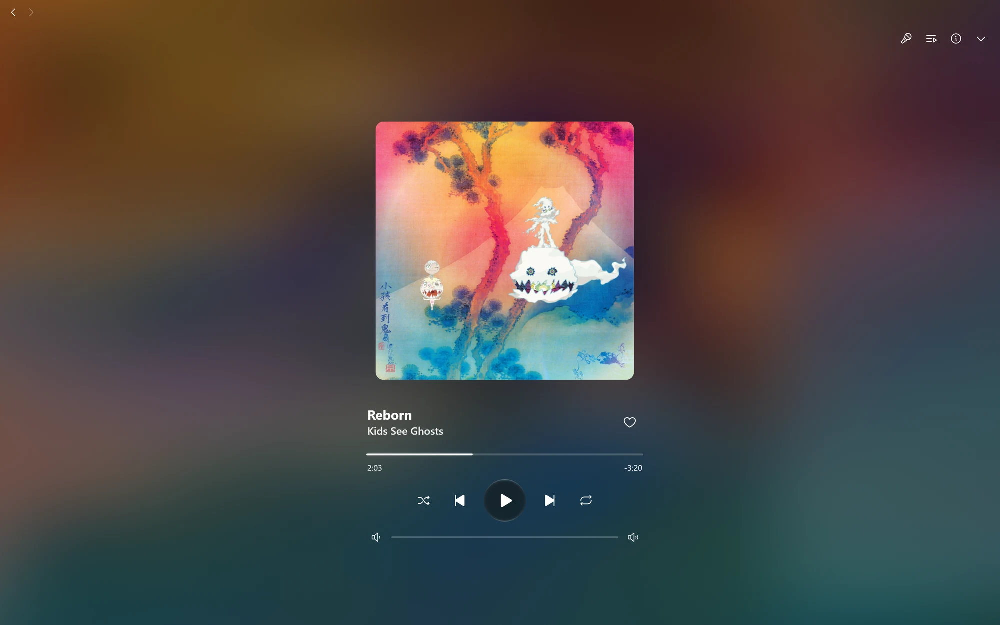
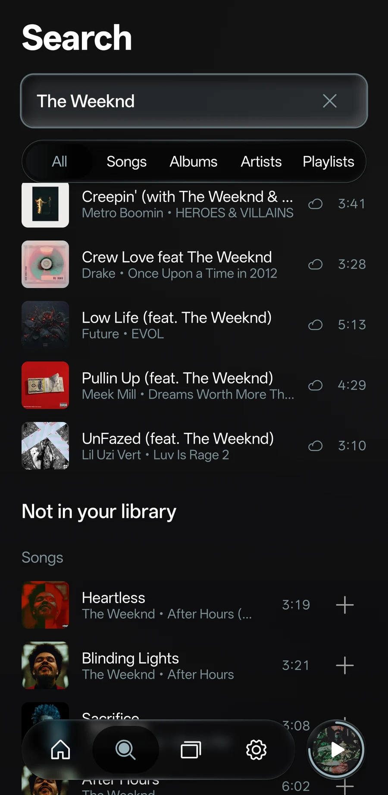
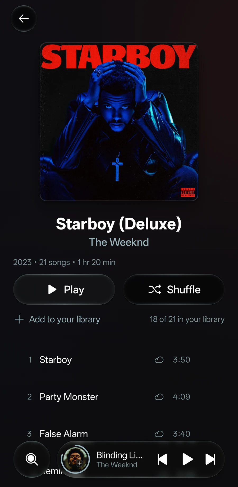
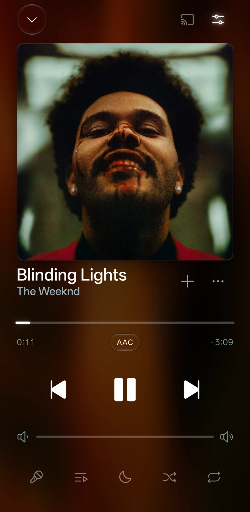

<div align="center">


# Octo

**Self-hosted music discovery for Navidrome.**
Play songs you don't own yet, and keep the ones you like as FLAC.

[](https://www.gnu.org/licenses/gpl-3.0)
[](https://dotnet.microsoft.com/)
[](https://docs.docker.com/compose/)
[](https://github.com/am-yy/octo/actions/workflows/ci.yml)

</div>

---

## Octo's own apps

Octo is a proxy, so it works with your Navidrome server and the Subsonic apps you already use. If you'd like players made to go with it, there are Octo apps for desktop and Android. In them, the music Octo finds sits beside your library, and keeping a song is just **Add to library**.


- **Add songs to your library.** Press **+** on a song, an album or a search result and it joins your library.
- **One search for everything.** Your music comes first, then what Octo found, and all of it plays straight away.
- **Whole albums.** Every track shows, the ones you have are marked, and one press adds the rest.
- **Your stations on Home**, each with its own painted cover.







<table>
<tr><td width="33%"></td><td width="33%"></td><td width="33%"></td></tr>
</table>

The desktop app runs on Windows and Linux, and the Android app on Android 10 and newer. They need Octo 2026.09.29 or newer, and they work as regular players with Navidrome too. Download them from [Octo for Windows and Linux](https://github.com/winters27/octo/releases/tag/desktop-v1.1.0) and [Octo for Android](https://github.com/winters27/octo/releases/tag/android-v1.1.0); the source is at [winters27/octo-player](https://github.com/winters27/octo-player).

## What Octo does

Octo sits in front of Navidrome and adds what a streaming service gives you: search past your own library, radio, and stations that learn from what you play. Missing songs stream from Deezer. The songs you keep arrive from Soulseek, Deezer, or your own Lidarr as tagged files in your library.

- **Search finds music you don't own**, and Deezer plays it directly or from the optional source cache.
- **Radio and stations grow from your listening:** Your Mix, discovery, artist and genre stations, plus optional genre and decade mixes from your own library.
- **Keep what you like.** Octo downloads it, tags it, files it under the right album and tells Navidrome to rescan. Whole albums work too.
- **Downloads are checked.** A "lossless" file made from an MP3 is caught, and optional Review and Duplicates playlists show what Octo couldn't confirm and what you have twice.
- **Lyrics** land beside downloads, and come in live for songs that have none.

Any Subsonic app works: point it at Octo instead of Navidrome and nothing else changes.

Deezer streaming and downloads require a private Deezer ARL session token. Soulseek and Navidrome playback continue to work without one.

## Get started

Octo sits **in front of** your existing Navidrome. Your Subsonic app talks to Octo; Octo adds discovery and previews, then proxies everything else through to Navidrome:

```
   Subsonic app          Octo               Navidrome
  (Feishin, Arpeggi) ──▶  :5274  ──────────▶  (your library)
                           ├─▶ Deezer        (direct streams and downloads)
                           ├─▶ slskd         (downloads on star)
                           └─▶ your Lidarr   (optional heart source)
```

Setup: **tell Octo where Navidrome is**, add the **Deezer ARL**, then **point your app at Octo**.

**Required**

- A box with [Docker](https://docs.docker.com/engine/install/) installed.
- An existing [Navidrome](https://www.navidrome.org/) server, reachable from the Octo host by LAN IP or service name (not `localhost`).
- A Deezer ARL session token for external streams and Deezer downloads.

**Optional** (Octo runs fine without these):

- A free [Last.fm API key](https://www.last.fm/api/account/create) enables radio and discovery.
- A free [Soulseek account](https://www.slsknet.org/news/node/1) enables peer FLAC downloads when you star a song.
- An existing [Lidarr](https://github.com/Lidarr/Lidarr) server: an alternative heart source once it has working indexers and a download client.

Then:

```bash
git clone https://github.com/am-yy/octo.git
cd octo
./install.sh
```

The installer asks for your Navidrome URL and Deezer ARL, then optionally Last.fm and Soulseek. It brings the stack up and prints the address.

**When it's done:**

- Point your Subsonic apps at `http://<your-host>:5274`, **not** Navidrome's own address.
- Octo checks your Navidrome sign-in before it plays or fetches a song from outside your library; while it cannot reach Navidrome, those songs are refused.
- Open the admin dashboard at **`http://<your-host>:5274/admin`** to manage every setting from the browser, with no config files to edit by hand.
  Sign in with a Navidrome admin account. See [Signing in](#signing-in).
- If a client reports the server is unreachable, that is Octo telling you setup is not finished: its ping response spells out exactly what to fix (usually the Navidrome URL).

## Compatible apps

| Works | App | Platform |
|---|---|---|
| ✅ | [Octo's own apps](#octos-own-apps) | Windows, Linux, Android |
| ✅ | [Feishin](https://github.com/jeffvli/feishin) | desktop |
| ✅ | [Supersonic](https://github.com/dweymouth/supersonic) | desktop |
| ✅ | [Sublime Music](https://github.com/sublime-music/sublime-music) | Linux |
| ✅ | [Arpeggi](https://www.reddit.com/r/arpeggiApp/) | iOS |
| ✅ | [Narjo](https://www.reddit.com/r/NarjoApp/) | iOS |
| ✅ | [Amperfy](https://github.com/BLeeEZ/amperfy) | iOS |
| ✅ | [DSub](https://github.com/daneren2005/Subsonic) | Android |
| ✅ | [Ultrasonic](https://gitlab.com/ultrasonic/ultrasonic) | Android |
| ✅ | [Tempo](https://github.com/CappielloAntonio/tempo) | Android |
| ✅ | [Audinaut](https://github.com/nvllsvm/Audinaut) | Android |
| ✅ | [SubTracks](https://github.com/austinried/subtracks) | Android / iOS |
| ✅ | Tempus | Android |
| ✅ | most other Subsonic apps | |
| 🟡 | [Symfonium](https://symfonium.app/) | your stations' tracks, not free-text search (see below) |

<details>
<summary><b>Symfonium, and apps that search in older ways</b></summary>

**Symfonium** copies your library to the phone and searches only that copy, so a typed search
never reaches Octo. What does reach Octo is the copy itself: Symfonium pages through the whole
library with an empty `search3` query. Octo continues that walk past your last song with
your radio stations' tracks that you don't own yet, so they land on the phone as ordinary
songs. There they search, browse and play as previews like anything else, the station
playlists find their tracks, and hearting one downloads it exactly as it does from any
other app. What you can't do is search for any song at all: search on the phone only finds
what the stations have suggested.

- Run a full sync in Symfonium to pick up new suggestions. Stations refresh as you listen,
  and Octo rebuilds the list when they change, or an hour after its last build.
- A song you heart shows up twice for a while: the preview, and the downloaded copy once
  Navidrome has scanned it. The next sync after the list is rebuilt drops the preview.
- Controlled under **Behavior → Discovery for offline-search apps** in the admin dashboard
  (`ENABLE_SYNC_CATALOG`, `SYNC_CATALOG_CLIENTS`, `SYNC_CATALOG_MAX_SONGS`). Only apps listed
  there get the extra tracks, so apps that search the server keep a clean library view.

**Both search generations are supported.** Subsonic has two search endpoints, `search2` and
`search3`, and Octo answers either. This matters more than it sounds: DSub and Ultrasonic
choose between them based on whether *you* browse by tags or by folders, not on the server
version, so a folder-browsing user talks `search2`. Both formats are supported too: some
clients speak JSON, some (DSub) only XML.

</details>

## Updating

```bash
git pull && ./install.sh
```

Re-running the installer keeps your existing answers.

Octo builds from source, so `git pull` is what actually updates it. `docker compose pull` only refreshes slskd.

### Which version am I on

Releases are dated, so `2026.07.29` is the release cut on that day. Your running version is shown under **About** in the admin dashboard, and it is the single most useful thing to include in a bug report.

To pin to a release instead of tracking `main`:

```bash
git checkout 2026.07.29 && ./install.sh
```

Upstream publishes multi-arch images to `ghcr.io/winters27/octo`. Build this fork from source
with the included Compose file to get its native FLAC cache and durable-save changes.

## Admin dashboard

`http://<your-host>:5274/admin`

Every setting has a form, every backing service has a live status indicator, and the **Raw Config** tab lets you edit the whole effective configuration as a JSON file if you'd rather work that way. Changes hot-reload: no rebuild, and no restart for most settings. The few that only apply after a restart are marked **Restart** where you edit them, and anything saved but still waiting on a restart is listed at the top of every page until you restart Octo.

### Signing in

The dashboard asks for a **Navidrome admin** account. Octo checks it with your Navidrome and
never keeps the password. A browser stays signed in for 90 days after its last visit, across
restarts. **Sign out** at the bottom of the sidebar ends it now, and **Sign out everywhere**
ends every browser and script signed in as you. Octo also ends them within an hour of
Navidrome removing your admin role or your account, as long as Octo has its own Navidrome admin
sign-in: the admin login on the **Music server** page, or a dashboard sign-in in the last day or
so.

- **Locked out?** If Navidrome is down or its address is wrong, choose **Use the recovery
  code** and type the code from `admin-recovery-code` in Octo's config folder
  (`docker exec octo cat /app/config/admin-recovery-code`). Each code works once, signs in for
  an hour, and can change settings but not library files. On a fresh install with no Navidrome
  found, the code is also printed in `docker logs octo`. Setting the Navidrome address restarts
  Octo, which ends a recovery sign-in; sign in with Navidrome after that.
- **Scripts** sign in the same way and keep the cookie. Keep the login in a file rather than
  on the command line, where it lands in shell history:

  ```bash
  # octo-login.json holds {"username":"admin","password":"..."}; chmod 600 it.
  curl -c octo.cookies -H 'Content-Type: application/json' -H 'X-Octo-Admin: 1' \
    --data @octo-login.json http://<your-host>:5274/api/admin/browse/auth
  curl -b octo.cookies -c octo.cookies http://<your-host>:5274/api/admin/settings
  ```

- **Behind a proxy that signs people in** (Authelia, Authentik), set `ADMIN_SIGN_IN=off` to
  skip Octo's own sign-in. The dashboard shows a red banner while it is off, because anyone
  who reaches it can then change Octo.
- **A port of its own:** `ADMIN_PORT=5275` serves the dashboard only on that port and refuses
  it on 5274, so 5274 can face your music apps while 5275 stays at home.
  Publish that port too.
- Your Navidrome decides who is an admin. On a fresh install Octo adopts the one Navidrome it
  finds on your network, so check that the **Music server** page names yours.
- Ten wrong sign-ins from one address in 15 minutes make that address wait.
- Over plain HTTP the password crosses your network the way Navidrome's own login does; put an
  HTTPS proxy in front if that matters to you.
- Saving settings, saving the raw config and restarting Octo each write a log line naming who
  did it.

Music apps never need the dashboard; they only use `/rest`. Keeping `/admin` and `/api/admin`
off a public hostname is still a good idea. Writes to the admin API must also carry an
`X-Octo-Admin` header, which a page on another website cannot add, so a site you visit cannot
change Octo through your signed-in browser.

Saved passwords, API keys, tokens and webhook addresses never come back out of the admin API:
they read as "(saved, not shown)", and saving that back keeps what is stored. A saved one is
also never sent to a new server address unless it is typed again with the address.

## Notifications

Optional push notifications for the download lifecycle, because Subsonic has no way to
tell you a starred track landed, or quietly settled for a lossy copy.

- **Two transports, either works alone**: [ntfy](https://ntfy.sh/) (paste a topic URL,
  subscribe to the same topic in the ntfy app) and Discord webhooks (rich embed with
  album art). A transport is on when its URL is set.
- **Five events, each with its own toggle** in the dashboard's Notifications tab:
  download started (did it find lossless, or is it settling?), download completed,
  lossless fallback, download failed, and one summary per album instead of a ping per
  track.
- A **Send test** button verifies your URLs and tokens without waiting for a real
  download, and reports each transport's outcome separately.

---

## Frequently asked questions

### Is Octo a self-hosted Spotify alternative?

It's the discovery half. Octo doesn't replace your music *server* (that's still Navidrome), but it adds the search-and-listen-to-anything experience that streaming services do well. With Octo plugged in, your Subsonic app behaves more like Spotify or Apple Music: search returns recommendations, radio works on any song, and you can preview tracks you don't own. The difference is that "I want to keep this" downloads it as a real FLAC into your library, instead of renting it.

### Does this work with Plex / Plexamp?

No. Octo speaks the Subsonic API, not the Plex API. If you're a Plex user looking for self-hosted alternatives with discovery, the move is Navidrome + Octo + a Subsonic client like Feishin or Arpeggi.

### How is this different from Navidrome's built-in radio?

Navidrome's radio plays songs from your existing library. Octo's radio reaches *outside* your library: Last.fm finds similar tracks, Deezer streams them, and Soulseek or Deezer can provide the keep-it-forever path. Navidrome alone gives you a great library player; Octo turns that library into a launchpad for discovery.

### Is my data going anywhere?

Octo's per-user play ledger and station snapshots stay in `/app/config/lastfm-radio-state.json`. It sends Last.fm only the artist, title, and tag lookups needed to build recommendations; it does not send the ledger, Navidrome credentials, usernames, or stream URLs. Continuous Radio URLs contain opaque, expiring in-memory session tokens rather than Navidrome credentials. Deezer and Soulseek receive the ordinary outbound requests needed for playback and acquisition. The Deezer ARL is stored in `.env` or `/app/config/settings.json`; the admin API masks it on reads. Once a listener connects Last.fm on the dashboard, Octo also sends that listener's plays of outside songs (artist, title, album and time) to their own Last.fm account, and with a ListenBrainz token set it sends the same plays to ListenBrainz.

### Do downloaded songs get tagged correctly?

Yes. Soulseek peers share full FLAC files with their existing ID3 tags intact. Octo organizes them per your `FolderStructure` setting (`Flat`, `ByArtist` or `Organized`), then triggers a Navidrome rescan so they appear in your library exactly like everything else you own.

### Can it run on a Raspberry Pi?

Yes. Multi-arch images are published for amd64 and arm64. Octo streams from Deezer directly; a Pi 4 or Pi 5 handles a single household's listening fine.

---

<details>
<summary><b>Advanced: architecture, technical details, more FAQ</b></summary>

### What if I don't want to use Soulseek?

You can use Deezer or an existing Lidarr server, or disable automatic acquisition entirely.

Use **Streams & hearts → Heart download priority** in the admin UI to order Soulseek, Deezer, and Lidarr and independently choose whether each handles song hearts, album hearts, or both. Octo tries eligible sources from top to bottom and stops at the first success. `DOWNLOAD_SOURCE`, `DOWNLOAD_ON_STAR`, and `DOWNLOAD_ALBUM_ON_STAR` remain migration defaults for existing and env-only installations.

Lidarr works at album level, so enabling it for song hearts still fetches the song's full album. It is last and disabled by default; configure its URL, API key, root folder, and profiles on the Lidarr page, then enable the heart types you want in the priority list.

To stop permanent acquisition, turn off both heart types for every source. On an env-only installation, set `Subsonic__DownloadOnStar=false` and `Subsonic__DownloadAlbumOnStar=false`. Octo still saves the heart immediately. With the FLAC cache enabled, it protects a playable copy independently of permanent acquisition.

`RECORD_REQUESTED_BY` (on by default) names the Subsonic user who asked for each download on
its entry in **Fetched songs** and on the download notification, so on a shared library you can
tell one person's acquisitions from another's. A track that two people star while it is still
downloading lists both, because the second star joins the transfer already running rather than
starting a second one. Acquisitions Octo starts itself are unattributed, as are all entries
written before this existed. Turning it off omits attribution from acquisition logs and notifications; existing names stay.
Per-user saved playlists and hearts still retain their owner.

### Why is Octo a refactor of [octo-radiostarr](https://github.com/winters27/octo-radiostarr)?

The earlier project leaned on SquidWTF (a public TIDAL proxy) for streaming. In April 2026 Tidal hardened their API and broke every TIDAL proxy at once. Octo now uses the Deezer backend adapted from octo-fiesta for direct MP3 streams and configurable permanent downloads, with Soulseek through slskd retained as a peer source. The old repo is archived; new development happens here.

### How is Octo different from [octo-fiesta](https://github.com/V1ck3s/octo-fiesta)?

Octo's earliest commits descended from [V1ck3s/octo-fiesta](https://github.com/V1ck3s/octo-fiesta) (via [bransoned/octo-fiestarr](https://github.com/bransoned/octo-fiestarr)). Octo's Deezer resolver adapts the account-session and audio-decryption flow from octo-fiesta, while preserving Octo's own Subsonic proxy, radio, acquisition, and file-management paths:

- **Playback:** an unowned song uses a strict FLAC or MP3 320 source, growing cache delivery, and optional client MP3/Opus transcoding. With caching disabled, originals stream directly. Continuous radio keeps MP3 transport. Both reuse the native Deezer resolver.
- **Acquisition:** heart a song or album to download from Soulseek, Deezer, or Lidarr in the order you choose. Deezer download quality defaults to FLAC and falls back to MP3 when unavailable.

Octo-fiesta supports multiple catalogs and Subsonic-proxy behaviors that Octo does not. Octo adds its Last.fm stations, admin UI, ordered acquisition sources, and multi-peer Soulseek retry around Deezer playback.

### Background

Octo is a full refactor of [octo-radiostarr](https://github.com/winters27/octo-radiostarr). That earlier project ran on SquidWTF + Tidal and broke when Tidal hardened their API in April 2026. Octo now uses Deezer directly for streams and configurable downloads, with Soulseek via slskd retained for peer downloads.

### Architecture

Two Docker containers run in the `docker compose` stack. Deezer is accessed directly over HTTPS:

```
Subsonic clients ──▶ Octo ──▶ Navidrome
                      ├────▶ Deezer
                      └────▶ slskd (Soulseek)
```

- **`octo`** (port 5274): the proxy + admin UI. Personalized Radio, its state store, recommendation queue, and refresh worker all run in this process. Octo hijacks the Subsonic endpoints that need enrichment and passes everything else through to Navidrome.
- **Deezer**: direct HTTPS playback and downloads use the configured ARL. Ordinary playback supports a strict FLAC or MP3 320 cache and client MP3/Opus transcoding; continuous radio uses MP3. Permanent download quality is configurable.
- **`slskd`** (port 5030): Soulseek client with REST API. Octo authenticates and queues downloads.

Navidrome is **not** part of the stack. Octo just talks to whatever Navidrome you already have.

### Configuration sources

Octo reads from three sources, highest priority first:

1. `settings.json` (admin UI writes here, hot-reloads in ~500ms).
2. Environment variables in `.env` / `docker-compose.yml`.
3. `appsettings.json` shipped with the image.

The admin UI's "Config sources" tab shows the merged effective value for every key.

Last.fm Radio is enabled by default. `LASTFM_EXPOSE_AS_PLAYLISTS` and
`LASTFM_EXPOSE_AS_STREAMS` independently publish Octo stations in those two client
surfaces; both default to true. Playlist tracks retain normal playback quality.
Continuous streams are normalized to `LASTFM_RADIO_STREAM_BITRATE_KBPS` (96, 128, 192,
256, or 320; default 192). Octo warms persisted stations at startup, publishes only
stations with a complete starter track, and maintains a three-track runway in its
bounded 24-hour/512 MiB temporary cache. Unplayable tracks are rejected for 24 hours
and replaced through the normal refresh path; no prepared track is added to the music
library. **Start radio from this song** remains a one-time `getSimilarSongs[2]` queue.

#### Radio sources

That queue, and every station, draws on four sources and blends their answers:

| Source | What it gives |
| --- | --- |
| Last.fm | songs like the seed, by its artist and title; similar artists; tag charts |
| YouTube Music | YouTube Music's radio for the song, which knows uploads Last.fm never heard of (nightcore and phonk channels included); for an artist, the artist's radio |
| ListenBrainz | recordings people play alongside it, from ListenBrainz's open listening data; with a ListenBrainz token, LB Radio for artist and genre stations |
| Sounds alike | library songs that sound like it (tempo, timbre, loudness, harmony), from Octo's own analysis of every file |

Each song scores its source's weight, times how closely that source matched the seed itself,
times its place in the source's list; a song more than one source suggests adds up. A source
with only a few songs counts less. When the catalogs have fewer than 20 songs like the seed
itself, as with a YouTube upload tagged with its uploader for the artist, the seed's own tags
lead: the rest of its album (for a library downloaded from playlists, the playlist), library
songs with its genre, and the top songs for that genre. Similar artists to the seed's artist
join only when the source knows the artist, so an uploader's name never picks the music. A
nightcore, sped up or remixed seed whose original is known gets songs like the original too,
behind its album and genre. A title written "Artist - Title" is also looked up under the artist
it names. An album id starts from its first song, an artist id from artists like them. In song
radio a library song that sounds far from the seed slips down and one that sounds close moves
up.

Every radio song carries `octoSuggestedBy`, the source that counted most for it, and the Octo
apps show it in the song's info. Radio also learns from listening: a radio song played through
counts for its source and one skipped counts against it, per listener, and each listener's
weights lean on the sources they keep (never below 0.3 or above 1.5). The dashboard's Radio page
has the switches, the base weights (YouTube Music 1.0, Last.fm 0.9, ListenBrainz 0.7, Sounds
alike 0.4), what radio has learned, and "Forget what radio learned". `RADIO_YOUTUBE_MUSIC`,
`RADIO_LISTENBRAINZ`, `RADIO_SOUNDS_ALIKE` and `RADIO_LEARN_FROM_LISTENING` switch them in `.env`.
YouTube Music and ListenBrainz receive the artist and title of the song a radio starts from.

Sounds alike runs in the `octo-sonic` service (bliss-rs). It reads each song once, one at a time
with `RADIO_SONIC_PAUSE_SECONDS` between, only while nothing downloads, then keeps up with new
and changed songs; a damaged file costs only that file. On a network mount the first pass takes
a while, and the dashboard shows how far it is, with Pause and Start over. `SONIC_CPUS` (default
1) caps the CPUs it may use; never set it above the machine's count, or Docker will not start it.
The first `docker compose build` compiles it, which takes several minutes.

`GENRE_NORMALIZE` collapses the genres downloads arrive with into a list you can browse.
Rules are a pattern-to-genre table applied **in order, first match wins**, edited in the
dashboard (or as `Genre.Mappings` in settings JSON) because encoding structured rows in
`.env` is brittle; a broad-genre preset is one click away. A built-in blocklist drops
YouTube categories, format tags and years, and `GENRE_BLOCKLIST` adds to it. `GENRE_MAX`
caps how many genres a track keeps, and defaults to keeping what is already there so
switching normalisation on is not itself destructive; set it to 1 for one broad genre per
track. `GENRE_ON_EMPTY` decides what happens when nothing
survives: `Clear` removes the genre and is the default, because genre was previously only
ever written when non-empty and never cleared, so junk like "People & Blogs" survived
forever; `Leave` keeps it and `Unknown` writes `GENRE_UNKNOWN_LABEL`. A file that had no
genre and resolved to none is left untouched either way. `GENRE_FALLBACK=LastFm` fills a
blank genre from Last.fm's top tags, which needs `LASTFM_API_KEY` but not radio. This
applies to new downloads. To apply it to files already in the library, the **Tags & genres** page
has a re-tag tool: pick a scope, **Preview changes** walks every file and writes nothing, and only
then can you apply. Apply is withheld if you change the scope or the rules after previewing,
because it would write something other than what the preview showed. An undo that is cancelled
or cannot reach a file keeps that file's entry, so running Undo again finishes the job. Like the rest of `/api/admin`, every one of its endpoints requires signing in with a
Navidrome admin account.

Applying records each changed genre frame in `/app/config/genre-backfill-journal.jsonl`, which
backs a one-click undo. **Undo restores the genre and nothing else**: writing a tag rewrites the
whole tag block, so an unusual field the tag library does not model is lost on the first save;
entries are matched by file path, so a file moved afterwards stays changed; and if that journal
is gone there is no undo at all. Keep your own backup of the music folder. A run that is
interrupted by a restart is never resumed automatically, since restarting may be how you
stopped it.

Library actions let a user fix a wrong download from the player they are already using, by
adding the track to an action playlist Octo keeps (`LIBRARY_ACTIONS_PLAYLISTS`) or, if they
turn it on, by rating it (`LIBRARY_ACTIONS_RATINGS`). `LIBRARY_ACTIONS_ENABLED` is off by
default, and the feature stays inert even when on until at least one username is added to the
allowlist in the dashboard: **an empty allowlist means nobody, never everybody.** The action
names, which actions exist, and which star count maps to which action are all editable, and
five stars means Keep, which removes nothing, so the top of the scale is never destructive.

`LIBRARY_ACTIONS_DRY_RUN` is on by default, so the first run of a newly enabled install is a
rehearsal you can read before anything is real. Nothing is ever deleted outright: removed files
move to `LIBRARY_ACTIONS_TRASH_DIR` under the music folder, with a sidecar manifest so a restore
works even if the action journal is lost, and only the retention sweep
(`LIBRARY_ACTIONS_TRASH_DAYS`, 0 to keep forever) really deletes. `LIBRARY_ACTIONS_POLL_SECONDS`
and `LIBRARY_ACTIONS_MAX_PER_CYCLE` bound how fast actions are noticed and applied.

Two things to know before turning ratings on. Clearing a rating afterwards needs the rating
owner's own credentials, because Subsonic ratings are per user, so **Octo caches a replayable
Subsonic auth triplet per user in memory** for as long as it runs. And because no client asks
for confirmation before setting a star, a mis-tap is a request. The playlists carry no such
risk, which is why they are the default.

An app can also remove a song directly, without a playlist or a rating, through the
`octoLibraryActions` extension, which is only listed while library actions are on.
`getLibraryActions` tells the caller whether actions are on, whether they are on the allowlist,
whether it is a dry run, and how many days a removed file is kept. `libraryAction` with an `id`
and `action=remove` does exactly what the Delete playlist does, with the same allowlist, dry run
and quarantine, as the user whose credentials it carries, and answers with what happened. The
Delete action has to be on for it to do anything. Both always answer in JSON.

`LIBRARY_ACTIONS_REVIEW` gives each allowed user a Review playlist, where Octo asks about the
downloads a person can settle by listening: AcoustID had never heard the recording, was not
sure of it, or heard a different one in a Deezer download. A download is asked about in the
playlist of the person who requested it when they are on the allowlist, and of every allowed
user otherwise. Answer by adding the track to an action playlist, by Keep (a fifth action that
removes nothing, on five stars by default), or by removing it from Review, which means "fine,
stop asking". Nothing in Review is ever acted on by itself, and a settled track is not asked
about again. `LIBRARY_ACTIONS_NOTICE_PREFIX` (`▸ ` by default) sets Octo's playlists apart
from the action playlists, since in one Octo asks you something and in the other you tell Octo
something, and `LIBRARY_ACTIONS_NOTICE_MAX` (default 100) is how many questions one playlist
holds at once; the rest wait their turn. `LIBRARY_ACTIONS_RATINGS_SCOPE` says where a star
counts as a command: `NoticeOnly` only on a track in Review or Duplicates, where the only
reason to rate it is to answer, and `Global` on any track. `Auto`, the default, is
`NoticeOnly` while either playlist is on and `Global` otherwise, which is how ratings behaved
before they existed.

`LIBRARY_ACTIONS_DUPLICATES` adds a Duplicates playlist per allowed user: recordings the
library holds more than once, side by side, the copy worth keeping first (lossless before
lossy, then the higher bitrate). Two files are copies only when they carry the same
MusicBrainz recording id and are the same version, so a live take, a remix, a radio edit or a
second part never is, and a file without a recording id is never grouped; Octo writes that id
on every download it confirms, and Picard does too. Octo only points copies out. Remove the
one you do not want with an action playlist; Keep, or taking a copy out of the playlist, says
the copies are on purpose and stops Octo asking about them. The library is walked every
`LIBRARY_ACTIONS_DUPLICATES_SCAN_HOURS` (default 24) with Octo's Navidrome admin credential,
and the dashboard can start a walk at once.

`SLSKD_VERIFY_DOWNLOADS` fingerprints each finished Soulseek download with Chromaprint and
identifies it through AcoustID before it joins the library, using the free key in
`ACOUSTID_API_KEY`. A file identified as a different recording is deleted and its peer and
filename are remembered in `/app/config/rejected-peers.json`, so that exact file is never
downloaded again; entries lapse after 30 days and the Soulseek admin page can forget them all
at once. `SLSKD_MIN_MATCH_SCORE` (50-99, default 85) is how sure AcoustID must be before its
answer may reject anything, so raising it makes Octo *more* permissive, because weaker matches
are ignored rather than acted on. A track with no AcoustID entry at all is always accepted.
`SLSKD_TAG_FROM_MUSICBRAINZ` writes the matched recording's MusicBrainz title, artist, album
and year over the peer's own tags. `NAME_FROM_MATCH` goes one step further and names the file
from the match as well (artist folder, title, album and track number), so the path and the
tags come from one decision; it is off by default because a canonical name is not always the
one you file under, and it only ever names files Octo downloads and confirms. Deezer
downloads are identified too, but never rejected: there is no second catalog candidate, so a
disagreement is kept and, with the Review playlist on, asked about. Verification needs
`fpcalc` in the runtime image (`libchromaprint-tools`); without it the feature logs once and
accepts everything. A song asked for with an ISRC (an album track Deezer listed) is also held
to that code: a file whose own tags carry it is confirmed even with no AcoustID key or entry,
and a fingerprint that names a recording spelled differently (a title in its own script, or
translated) is confirmed when MusicBrainz lists the ISRC on it. A different ISRC never rejects
a file, since re-releases are often given new codes.

"Catch fake lossless files" on the Soulseek admin page (on by default) checks every download
that claims to be lossless for a lossy file converted to it. Octo decodes a few seconds from
several points in the track with ffmpeg and looks for the cutoff a lossy encoder leaves: about
17 kHz for a 128 kbps MP3, 19 kHz for 192, 20 kHz for 256 and 320. It needs a steep drop that
stays at the floor, so a recording that is simply quiet up high is never called fake. A likely
transcode is held back while the next lossless copy is tried, and kept when no peer has a
genuine one: it is still the right song, and the download record notes what it was likely
made from. The better-quality library action refuses a transcode as a replacement, and the
Duplicates playlist never suggests one over a genuine lossless copy.

`ACOUSTID_SUBMIT` sends answers back. When someone Keeps a track from Review that AcoustID had
never heard or was not sure of, Octo submits its fingerprint with the MusicBrainz recording it
belongs to, so the next lookup of that recording is a confident one. It needs your own
AcoustID user key in `ACOUSTID_USER_KEY` (from acoustid.org/api-key once signed in) as well as
the application key, and sends the fingerprint, its length, the recording id and the file
format, never a file name, a path or a username. Nothing is sent in rehearsal mode, for a
track AcoustID named as something else, for a fingerprint other than the standard 120 seconds
(`SLSKD_FINGERPRINT_SECONDS`), or when no single MusicBrainz recording fits the track's title,
artist and length.

Each kind of dynamic station is configured on its own, so a listener can keep Your Mix
without collecting an artist radio per favourite band. `LASTFM_ENABLE_YOUR_MIX` and
`LASTFM_ENABLE_DISCOVERY_MIX` (both default true) switch those two stations,
`LASTFM_ARTIST_STATION_COUNT` (default 2) and `LASTFM_GENRE_STATION_COUNT` (default 3)
say how many of each to build, and 0 builds none. The defaults are what Octo has always
produced. All four take effect without a restart, and switching one off removes those
stations from clients on the next request.

Discovery Mix is artists the listener does not know yet. Octo walks Last.fm's similar artists
out from their ten strongest artists, so an artist several favourites point to leads, then
takes one more step from the best new names at half weight. Anyone they have played, anyone
in the Navidrome library, and any artist with a one-star song is left out. Each of the 30
best new artists gives up to three of its top songs, and at most two of an artist's songs
make the station. When that finds fewer than five songs, Discovery Mix falls back to the
charts of the listener's top tags. Elsewhere, known artists keep 30% of their weight among a
station's suggestions in Your Mix and genre radio (Your Mix's familiar share is unaffected),
and an artist radio's neighbours lean toward artists the listener has not heard. With a
ListenBrainz token, LB Radio joins artist and genre stations in `RADIO_LISTENBRAINZ_MODE`
(`easy`, `medium` by default, or `hard`; the further modes reach less played songs).

Other Radio defaults use
`LASTFM_ENABLE_PERSONALIZED_STATIONS`, `LASTFM_ENABLE_DISCOVERY_STATIONS`,
`LASTFM_HISTORY_RETENTION_DAYS`, `LASTFM_DISCOVERY_PERCENT`,
`LASTFM_RADIO_TRACK_COUNT`, `LASTFM_REFRESH_INTERVAL_HOURS`, and
`LASTFM_MINIMUM_PLAYS`. Pinned categories are managed as
`LastFm.DiscoveryStations` in the existing Last.fm admin tab or settings JSON because
encoding structured rows in `.env` is brittle.

The in-process worker refreshes stale snapshots in the background while retaining the
last good version. State is bounded and versioned in
`/app/config/lastfm-radio-state.json`; do not share that file across Octo instances
because cross-process locking is not supported.

### Made for you

Every listener gets three lists, made again every day from their own plays, on the Octo apps'
Home under **Made for you** and as read-only playlists in every other app:

- **New Releases:** albums, EPs and singles from the `NEW_RELEASE_ARTISTS` artists they play
  most (default 50), released in the last `NEW_RELEASE_WEEKS` (default 8), newest first, a few
  songs from each. Songs they already have are their own copies; the rest play right away and
  can be added with **+**. Release dates come from Deezer, which needs no key.
- **Rediscover:** songs they loved (played three times or more, hearted, or rated 4 or more)
  and have not played for `REDISCOVER_MONTHS` (default 6).
- **Deep Cuts:** songs played once or never, from the 15 artists they play most.

They are on by default; `FOR_YOU_NEW_RELEASES`, `FOR_YOU_REDISCOVER` and `FOR_YOU_DEEP_CUTS`
switch each off, as does the dashboard's Mixes page. Plays, hearts and ratings are Navidrome's,
read as that listener, so a list is made the next time their app lists playlists. A library
bigger than 40,000 songs is read as far as its first 40,000.

### Mixes

`MIXES_ENABLED` adds genre and decade mixes drawn from each listener's own library, listed
beside the radio stations and served by Octo in the same way: per listener, read-only, and
never written to Navidrome, so a rescan cannot empty one and nobody edits one by accident.
`MIXES_GENRES` and `MIXES_DECADES` choose the kinds. A genre or decade gets a mix once it has
`MIX_CREATE_AT` tracks (default 20) and loses it only below `MIX_REMOVE_BELOW` (default 10),
so one at the edge does not come and go, and `MIX_MAX_PLAYLISTS` (default 20) shows the
largest first. Years and anything on the genre blocklist never get a mix of their own.

Each mix holds `MIX_TRACK_COUNT` tracks (default 100) with at most `MIX_MAX_PER_ARTIST` (3)
by one artist; the cap is never relaxed, so a mix that cannot be filled without breaking it
is shorter. A mix is a seeded draw that holds still for `MIX_REFRESH_HOURS` (24), so every
client shows the same tracks, and is then drawn again. `MIX_NEW_SHARE` keeps that percentage
of each mix, and of the Discovery Mix station, for tracks new to the listener: never played,
or added in the last `MIX_NEW_DAYS`. It is 0 by default, which changes nothing.
`MIX_NAME_FORMAT` names them, `{0}` being the genre or decade ("{0} Mix" when empty).

Mix and station covers are drawn by Octo in the same design as the Octo apps' playlist
covers: the list's name in white over one of 48 painted backgrounds, picked to match the
colours of the covers of its first songs (a station's seed artist first), or its genre's or
decade's colour when those give none. The same list keeps the same background while its
music does. Under the words the background is darkened only as far as white needs, keeping
its colour. Names are set in [Inter](https://github.com/rsms/inter) 4.1 (SIL Open Font
License, shipped as `licenses/Inter-OFL.txt`); names in scripts Inter lacks use Noto CJK,
DejaVu or Symbola from the image. No cover carries an Octo mark. A picture in
`/app/config/covers` named after a mix or station (`Rock Mix.jpg`), or after its genre or
decade (`Rock.png`), replaces its cover, and replacing the picture shows without a restart.

### Popular right now

Every listener also gets **Popular right now**, a read-only playlist of the chart of the moment
in every app: Deezer's 50 most played songs for the country Octo's server is in (Last.fm's
chart when Deezer does not answer), the same chart the Octo apps show in search before anything
is typed. Songs the listener has are their own library copies; the rest play right away and are
added with a heart, like any outside song. It is made with the listener's own sign-in the next
time their app lists playlists and holds still for 6 hours, so every app shows the same songs.
A chart or library that does not answer keeps the last list rather than emptying it. Outside
songs are left out while `ENABLE_SEARCH_DISCOVERY` is off and follow `EXPLICIT_FILTER`, as the
stations do. Its cover is drawn like a mix's, from its first songs' covers. It is on by
default, whether or not the mixes are; `POPULAR_NOW=false` or the dashboard's Mixes page turns
it off. Apps that copy the library to the device (Symfonium) get its outside songs in their
sync catalog, so the playlist finds them there.

### Download path on Windows and manual installs

`DOWNLOAD_PATH` in `.env` is a HOST path: it is bind-mounted as `/music` into the octo and slskd containers, and it is the only path you change to move the library. Container-side settings (Octo's `Library__DownloadPath`, slskd's downloads dir) stay `/music`.

- **Windows (Docker Desktop)**: use forward slashes, e.g. `DOWNLOAD_PATH=E:/Media/Music`. Do not put a drive-letter path in the admin UI's download path field; that field is a path inside the container.
- **Manual installs** (not using the bundled compose file): slskd's `directories.downloads` must resolve to the same directory Octo's `Library:DownloadPath` points at, or Octo will never see finished downloads. Set it with the `SLSKD_DOWNLOADS_DIR` environment variable, and note that a value set in `slskd.yml` overrides that env var (slskd precedence: env vars < yaml).

### Existing Lidarr setup

Set `LIDARR_URL` and `LIDARR_API_KEY`, restart Octo, then open the **Lidarr** admin tab to test the connection and choose its root folder and profiles. Enable and position Lidarr under **Downloads → Heart download priority**. Octo does not install or configure Lidarr's indexers or download client.

The **Lidarr** tab also offers **Refresh full artist catalog for new artists** (`Lidarr:RefreshArtistOnAdd`) and **Monitor requested albums** (`Lidarr:MonitorRequestedAlbums`), both enabled by default. Refresh reuses Lidarr’s automatic artist refresh and requests one only when missing. Disabling it suppresses Octo’s fallback, not Lidarr’s own refreshes. The metadata profile still controls which releases load; this does not request the discography. A new artist has only the requested album monitored, automatic monitoring of new releases disabled, and no search for other missing albums. The artist's monitoring switch is enabled so Lidarr can process that album. Requests for existing artists preserve other album flags; re-enabling an unmonitored artist also disables automatic monitoring of new releases. Disabling requested-album monitoring preserves existing monitoring choices and adds new albums unmonitored; the explicit search still targets only the requested album.

The selected Lidarr root and Octo's effective Navidrome library root must expose the same underlying files. Their container paths may differ: Octo translates the imported path relative to the selected Lidarr root. For example, Lidarr `/data/music/Artist/Album/file.flac` can map to Octo `/music/Artist/Album/file.flac` when both mounts point at the same host directory.

When track metadata is missing, Octo waits for matching active metadata refreshes before searching. An existing album with no tracks gets one targeted `RefreshAlbum` recovery. Failed refreshes or successful refreshes that still leave no tracks fail before `AlbumSearch`; preparation honors cancellation and the configured import timeout.

`LIDARR_COMPLETION_MODE=Accepted` (default) returns control after Lidarr accepts the album search. `Imported` makes completion/failure notifications reflect the actual import, bounded by `LIDARR_IMPORT_TIMEOUT_SECONDS` (default 1800). Neither mode blocks playback or later hearts; imported files are reconciled into download history and trigger a Navidrome scan in the background.

Optionally set `LIDARR_WEBHOOK_SECRET` and add a Webhook under Lidarr's **Settings → Connect** with URL `http://octo:8080/api/lidarr/webhook` (Octo's address as Lidarr reaches it), the **On Release Import** and **On Upgrade** triggers, any username and that secret as password. Each import then asks Navidrome to scan and checks saved hearts and playlists every 5 seconds for 2 minutes, so they switch to the library copy almost at once instead of on the next minute's check. This also covers albums imported after the timeout above or an Octo restart. Without the secret the endpoint answers 404.

### Playback and acquisition

Tracks already in your library play through Navidrome. Missing external results play from a growing shared Deezer source; disabled caching uses temporary staging with the same validation; heart the song or album to run the configured permanent acquisition priority.

Recording lookup keeps Deezer REST first, checking up to three pages of 100 candidates across
query variants and pagination. A miss tries Deezer's anonymous web recording search, then the
existing matching-single/album recovery. Discovery has a shared seven-request, five-second
budget including queue time, authentication and selected-track verification. Truncated or failed
answers remain retryable; only a complete no-match is negative-cached. Concurrent equivalent
lookups share work, while canceling one waiter leaves other callers running. Artist, title and
recording-version evidence must agree; provider media substitutions receive the same checks.

Enable `Deezer:CacheEnabled` for durable source copies independent of permanent acquisition.
`Deezer:CacheQuality` selects strict `FLAC` (default) or `MP3_320`; unavailable quality fails
without a lossy fallback. Existing copies and track-level pins survive quality changes.
Set `Deezer:CachePath` to a persistent directory outside the music library (mount it into Docker).
With the included Compose file, set `DEEZER_CACHE_ENABLED=true`; `DEEZER_CACHE_HOST_PATH`
defaults to `./octo-cache/deezer`, mounted at `/app/cache/deezer`. Size and retention use
`DEEZER_CACHE_MAX_GIB` and `DEEZER_CACHE_RETENTION_DAYS`. Restart after enabling the cache.
Cold playback receives flushed frames while download continues. Full format, length and ffmpeg
validation gate atomic publication and successful response completion. Raw delivery supports
byte ranges and `If-Range`; HEAD probes start neither a fill nor an encoder.
Clients can request `format=mp3` or `format=opus` with `maxBitRate` and `timeOffset`;
explicit transcoding defaults to 128 kbps. Missing format with a positive bitrate cap selects
MP3; `format=raw` delivers the original. Shared encoders consume the growing source through
a loopback-only, source-bound capability. Cold encoded output has no length or byte-range
promise; completed output supports ranges. Downloads always use the original selected source
and require the caller's download permission. Library tracks keep Navidrome transcoding.
`CacheMaxGiB` defaults to 20 and `CacheRetentionDays` to seven, measured from explicit playback,
or download completion for never-played files. Prefetch and range probes do not refresh retention.
Search prefetches the first 12 visible results; playlists, queues and radio starters prefetch eight.
Four source transfers run at once, at most two background fills, and four encoders.
Playback, seeking and downloads take priority. Unfinished sources are capped at four times
`MaxConcurrentDownloads`: 16 with the defaults, with at most 12 background admissions. Existing
source joins and completed copies remain available at capacity. Excess distinct sources or
encoders return HTTP 429 with `Retry-After: 5`; deferred pins remain durable and retry fairly.
Source establishment allows three attempts, refreshing media before switching accounts, and
freezes source identity after opening. Shutdown rejects new delivery with HTTP 503 and
`Retry-After: 5`, cancels owned work, and reaps encoders without publishing incomplete audio.
Temporary staging is removed after readers release it; startup removes abrupt-stop orphans.
Only one process may own a `CachePath`; no cross-process locking is provided.
Cache quality and concurrency changes require restart. Compose exposes
`DEEZER_CACHE_QUALITY`, `DEEZER_MAX_CONCURRENT_DOWNLOADS`,
`DEEZER_MAX_CONCURRENT_BACKGROUND_DOWNLOADS` and `DEEZER_MAX_CONCURRENT_TRANSCODES`.
Encoded copies remain unpinned and share the unpinned budget. Continuous radio keeps MP3.
Lidarr preparation retries after restart, while accepted album searches are not repeated.
If Octo loses the response during command submission, it keeps the claim and checks imports;
Lidarr offers no idempotency key, so that ambiguous window requires checking Lidarr before a manual retry.

Song hearts and mixed playlists edited through Octo save immediately to
`/app/config/external-saves.json`, including duplicates, order, metadata and acquisition intents.
Manual references pin one shared cache copy until a usable FLAC import replaces them in place;
generated playlists do not pin, and pinned copies may exceed the cache budget. Imports reconcile
every minute after restart; ambiguous or lossy matches remain virtual. Old external IDs remain
playback aliases. Navidrome writes use the caller's authorized session and retry on later sessions.
Direct Navidrome displays only imported entries. Store no caller credentials on disk.

Set `DEEZER_ARL` in `.env` or enter it under **Streams & hearts** in the admin UI. An optional `DEEZER_ARL_FALLBACK` gives Octo another session to try if the primary expires or is rate-limited. Both ARLs are masked when read back. `DEEZER_QUALITY` chooses permanent download quality: `FLAC` by default, then MP3 fallback, or `MP3_320` / `MP3_128`. ARL and permanent download quality changes apply without restarting Octo; cache quality and concurrency changes require restart.

Set `WAIT_FOR_LOSSLESS_ON_PLAY=true` if you would rather the first play wait for the lossless file. It is off by default because a Soulseek fetch routinely takes minutes and most clients time out long before that, which looks like the play failing. Restart after changing it. External catalog format follows `CacheQuality` independently of permanent acquisition.

Navidrome scrobbles your library plays itself. Songs Octo plays from outside your library are unknown to Navidrome, so Octo sends them to ListenBrainz (when a token is set) and, once connected, to Last.fm. For Last.fm, paste your API key and its shared secret on the dashboard's Last.fm page (or set `LASTFM_API_KEY` and `LASTFM_API_SECRET`); Save checks both with Last.fm. Then press **Connect** next to a listener and allow access on last.fm while signed in as that person. The dashboard notices by itself when that is done, and for someone else you can copy the link and send it to them. Each listener has their own connection, and library plays are never sent twice. If an app already scrobbles to Last.fm itself, turn that off or outside plays count twice.

### Folder layouts

- `Flat` *(default)*: `Artist - Title.flac`.
- `ByArtist`: `Artist/Title.flac`.
- `Organized`: `Artist/Album/01 - Title.flac`. A track with no known album falls back to its own title as the folder. Existing files are never moved; this only affects new downloads.

A download is filed once it has been tagged, so the album Deezer finds for a track that arrived without one names its folder. When no album turns up anywhere (the source, Deezer or the file's own tags), the track is filed as a single under its title (`ALBUM_FROM_TITLE`, on by default) rather than joining the one `[Unknown Album]` Navidrome gives every album-less track; a compilation is left alone, since a hundred one-track albums would be worse. A collaboration's folder is named after its first artist, and only when MusicBrainz or Deezer says who that is: `Bizarrap, Rauw Alejandro` is filed under `Bizarrap/`, while `Earth, Wind & Fire` and `Tyler, The Creator` stay whole because every source names them whole. The full credit stays in the artist tag, and each artist also gets a value of their own in the `ARTISTS` tag, so Navidrome lists the track under every one of them. File names keep annotations that name a different recording, such as `(Live)`, `[Remix]` and `(feat. X)`, and drop only upload noise like `(Official Video)`. A file already at the chosen path is replaced only when it is provably the same song; anything else keeps both.

### Tags, covers and lyrics

Every download is tagged from its source, Deezer and, with verification on, MusicBrainz. A fingerprint-confirmed recording's id is written to `MUSICBRAINZ_TRACKID`, so no later pass has to identify the file again; the album id is deliberately not written, because Navidrome groups albums by it before the album name and a track carrying it beside one without it splits an album.

Cover art comes from a chain, and the largest cover found wins: Apple's full-size master of the same album (often 3000 px, taken only when the artist and album name match), the Cover Art Archive when a fingerprint named the release (`COVER_ART_ARCHIVE`), then the catalog's own cover, then Deezer, iTunes and Last.fm by name, and last the file's own art. A cover that is not square is a video thumbnail and counts as missing (`REPLACE_VIDEO_COVERS`); when nothing better turns up its centre square is used, which for a YouTube "Topic" upload is the real cover inside the letterbox. Each song carries the cover at 1500 px, or at the full size it was found with `FULL_SIZE_COVERS=true`. `COVER_FILE` also writes a full-size `cover.jpg` beside the file, only in the `Organized` layout and only in a folder the download created, because Navidrome ranks `cover.*` above embedded art and a new file in an existing album folder would change that album's cover. A `cover.jpg` Octo wrote itself gives way to a larger one later; one you put there never changes.

**Soft covers** (dashboard, Cover art) finds soft covers and replaces the ones you pick. A scan reads your songs only, Octo's downloads or the whole library, and shows every album whose cover is smaller than the size you choose (or missing) as a wall of covers. Pick all of them or just some, find better covers (each tile then shows the larger one it found), then replace: each album gets the largest cover any of those sources has, in every song and, if you ask, in a JPEG `cover.jpg` or `folder.jpg` beside it. A cover is replaced only when the new one is clearly larger, every cover replaced is kept so Undo puts them all back, and lookups pause between albums so Apple's limit holds.

`LYRICS_FETCH` (off by default) writes lyrics beside each download, looked up in the background so a slow service never holds up the next download, and answers `getLyricsBySongId` live for any song as it plays when the library has none, external songs included. Synced lyrics go in a `.lrc` and plain ones in a `.txt` with the audio file's name, both of which Navidrome reads at request time without a rescan; an instrumental gets nothing, and a file that already has lyrics is never touched. `LYRICS_SOURCES` sets the order: `kugou` (timed word by word for most songs, but an unofficial API that can change without notice), `lrclib` (open, timed line by line), `lyricsovh` (plain text), and `netease`, which goes much deeper on non-Western and older music but is also an unofficial API, so it only runs when you list it. Leave a source out and it is never contacted. The order was chosen by measurement: see [docs/lyrics-source-eval.md](docs/lyrics-source-eval.md). Every source is held to the same rule before its lyrics are used: the same title (a remix or a live take never stands in for the original), the same artist, and a length within three seconds. Credits at the top of a lyric are stripped.

Word timing reaches every client that can use it. A `.lrc` with word timing is enhanced LRC: each line keeps its standard `[mm:ss.xx]` tag, so any player shows it line by line, and `<mm:ss.xx>` tags time the words, which Navidrome turns into OpenSubsonic word cues. `getLyricsBySongId` answers with the same cues for the songs Octo answers itself, but only when the client asks for them with `enhanced=true`; a client that does not ask gets exactly the lines it always got. `LYRICS_PREFER_WORD_TIMED` (on by default) lets a later source with word timing win over an earlier one with only line timing. The legacy `getLyrics` call (artist and title) gets the same lookup as plain text.

On the dashboard, **Find lyrics for the library** walks the songs that have no lyrics file and no lyrics in their tags, one at a time with a pause between, and can be stopped and resumed. By default it only writes beside songs Octo downloaded; `LYRICS_WRITE_BESIDE_ALL` lets it write beside every library song, and an existing lyrics file or lyrics inside a song are never replaced either way. Matches it is not sure of (a length it could not check, say) go on a review list. **Fix a song's lyrics** chooses other lyrics for one song, hides them, or goes back to automatic, for every app at once. The Octo app does the same through the `octoLyrics` extension (`getLyricsCandidates`, `setLyricsChoice`).

### Subsonic API surface

Octo hijacks these endpoints; everything else proxies to Navidrome unchanged:

| Endpoint | Why |
|---|---|
| `search3` | merge local + Last.fm-driven external songs and Deezer-driven external albums; later pages carry on through the outside songs page one started |
| `getSimilarSongs2` | radio queue blended from Last.fm, YouTube Music, ListenBrainz and Sounds alike, local first; a song the catalogs cannot place is led by its album and genre; each song carries `octoSuggestedBy` |
| `getPlaylists`, `getPlaylist` | append authenticated per-user read-only Radio snapshots, mixes and Popular right now, and materialize tracks local-first |
| `createPlaylist`, `updatePlaylist`, `deletePlaylist` | protect reserved Radio IDs while relaying ordinary mutations |
| `getInternetRadioStations` | append startup-warmed authenticated Octo stations immediately, with a one-starter same-request fallback, while preserving ordinary internet radio |
| `createInternetRadioStation`, `updateInternetRadioStation`, `deleteInternetRadioStation` | protect Octo stations while relaying ordinary internet-radio mutations |
| `/radio/stream/{token}` | consume the ready MP3 pool, optionally frame its existing artist/title as client-requested ICY metadata, and replenish it until disconnect |
| `stream` / `download` | selected FLAC/MP3 source, progressive playback and original downloads with HEAD/range support; client MP3/Opus transcoding |
| `getCoverArt` | Deezer → iTunes → Last.fm aggregator with Octo watermark |
| `getArtist` | an artist's albums, EPs and singles from Deezer beside the ones you own, each with its OpenSubsonic `releaseTypes` |
| `getAlbum` | external album tracklists, and fills in tracks you're missing from an album you own |
| `star` | try enabled heart sources in priority order and stop after the first successful track/album acquisition |
| `scrobble` | relay library plays to Navidrome, send outside plays to ListenBrainz and Last.fm instead (Navidrome does not know them), prewarm the next 8, and learn deduplicated completed plays for the authenticated user |
| `getTranscodeDecision` / `getTranscodeStream` | OpenSubsonic: negotiate client capabilities and stream authenticated output; library tracks relay to Navidrome |
| `getLyricsBySongId`, `getLyrics` | lyrics for outside songs and for library songs Navidrome has none for; chosen or hidden lyrics for every client; word cues with `enhanced=true` |
| `getLyricsCandidates`, `setLyricsChoice` | the `octoLyrics` extension: every lyrics entry for a song, and pinning one, hiding lyrics, or going back to automatic |
| `getLibraryActions`, `libraryAction` | the `octoLibraryActions` extension: what the caller may do to library files, and removing one song the way the Delete playlist does |
| `getTopSongs` | the standard top songs of an artist (by name, or by id as Navidrome's `topSongsByArtistId`), for every app: ranked as `getArtistTopSongs` ranks them, songs you have as your library's own and the rest as outside songs (only yours while search discovery is off); Navidrome's answer when Octo has none |
| `getArtistTopSongs`, `getTopChart` | the `octoTopSongs` extension: an artist's most played songs and the chart of the moment, each marked in the caller's library or playable from outside it |
| `/api/artist/{id}`, `/api/album?artist_id=` | Navidrome's own API, for clients that use it (Feishin): an outside artist's page and its albums |
| `getOpenSubsonicExtensions` | Navidrome's list plus `octoAcquisitions`, `octoLyrics` (while lyrics lookups are on), `octoLibraryActions` (while library actions are on), `octoRadioSources` (while radio can answer: radio songs carry `octoSuggestedBy`) and `songLyrics` 1 and 2 |

### Soulseek download details

When a song is starred, Octo:

1. Searches Soulseek for `<artist> <title>` (cleaned of `[brackets]` and redundant `Artist - ` prefixes).
2. Falls back to title-only search if the first query returns nothing usable.
3. Ranks candidates by queue depth, upload speed, file size.
4. Tries the top 5 peers in sequence with a per-peer timeout of 180 seconds by default (`SLSKD_DOWNLOAD_TIMEOUT_SECONDS`).
5. Verifies the file landed on disk (slskd's polling endpoint sometimes drops successful transfers between polls).
6. Renames per `FolderStructure` setting and triggers a Navidrome rescan.

Around 30 to 50% of Soulseek peer requests get rejected ("overwhelmed", queue full, banned). Single-peer-try downloads were too fragile; multi-peer is the difference between "downloads sometimes work" and "downloads reliably work."

Starring an album runs the same process once per track, in sequence.

> **Hearting is "fetch", not "favorite".** Navidrome has never seen Octo's IDs for music you don't own yet, so there is nothing on its side to mark as starred. Once the files land and Navidrome rescans, they become ordinary library tracks: present, but not favorited. Star them again in your app if you want them flagged.

### Cover art aggregator

Three sources tried in order; first hit wins:

1. **Deezer**: broad international catalog, picks 1000×1000 covers.
2. **iTunes**: limit=5, scored by artist match (avoids "Karaoke Version" hits).
3. **Last.fm**: track-level images, skips the deprecated artist-image placeholder.

Cached cross-source so a queue scroll doesn't trigger N external API calls per visible song.

### FAQ

**Do downloaded songs get tagged?**
Yes. slskd downloads are full FLACs from peer libraries that already have ID3 tags. Octo organizes them per `FolderStructure`, then triggers a Navidrome rescan.

**What if all 5 Soulseek peers reject?**
The next source in your heart order is tried. If every one fails and notifications are set up, you get a **Download failed** message; your music app itself hears nothing, because the heart was answered straight away. The heart may clear on the app's next sync, since Navidrome never stored a favourite for a song it doesn't have. Try again later or grab the file by hand.

**Can it run without Soulseek?**
Yes. Enable Deezer for direct downloads, Lidarr for album-level heart acquisition, or disable every song-heart source to keep discovery without automatic acquisition.

**Can it run without Last.fm?**
Yes. Existing snapshots are served first; Starter and pinned stations can fall back to accessible local seeds/genres, but fresh external discovery is degraded. The Last.fm pane reports that state explicitly.

### Development

```bash
dotnet restore
dotnet build
dotnet test
```

To build and preview the admin UI locally in an isolated Docker container:

```bash
./scripts/preview-admin.sh
```

The script opens `http://localhost:5277/admin/index.html` and uses temporary in-container settings and music directories. Run `./scripts/preview-admin.sh stop` when finished. Pass a different port as the first argument if needed.

Project layout:

| Path | What's there |
|---|---|
| `octo/Controllers/` | Subsonic API surface, admin API |
| `octo/Services/Soulseek/` | slskd client, multi-peer download logic |
| `octo/Services/Lidarr/` | Lidarr API, album submission, import reconciliation |
| `octo/Services/Deezer/` | Deezer playback and download resolver |
| `octo/Services/CoverArt/` | Deezer / iTunes / Last.fm aggregator |
| `octo/Services/LastFm/` | Last.fm client, Radio state/recommendations, in-process refresh queue and worker |
| `octo/Services/Subsonic/` | request parsing, response building |
| `octo/Services/Admin/` | settings file writer (atomic, deep-merge) |
| `octo/wwwroot/admin/` | the admin UI (vanilla JS, hand-rolled CSS, no build step) |

</details>

---

## License

[GPL-3.0](LICENSE)

## Acknowledgments

- [**Navidrome**](https://www.navidrome.org/): the music server Octo proxies.
- [**slskd**](https://github.com/slskd/slskd): Soulseek with a REST API.
- [**Lidarr**](https://github.com/Lidarr/Lidarr): optional album acquisition and import manager.
- [**Last.fm**](https://www.last.fm/api): similar-tracks API.
- [**V1ck3s/octo-fiesta**](https://github.com/V1ck3s/octo-fiesta): source for Octo's adapted Deezer account-session and audio-decryption backend, and the upstream root of this lineage.
- [**bransoned/octo-fiestarr**](https://github.com/bransoned/octo-fiestarr): the intermediate fork of octo-fiesta whose codebase Octo's earliest commits descended from.
